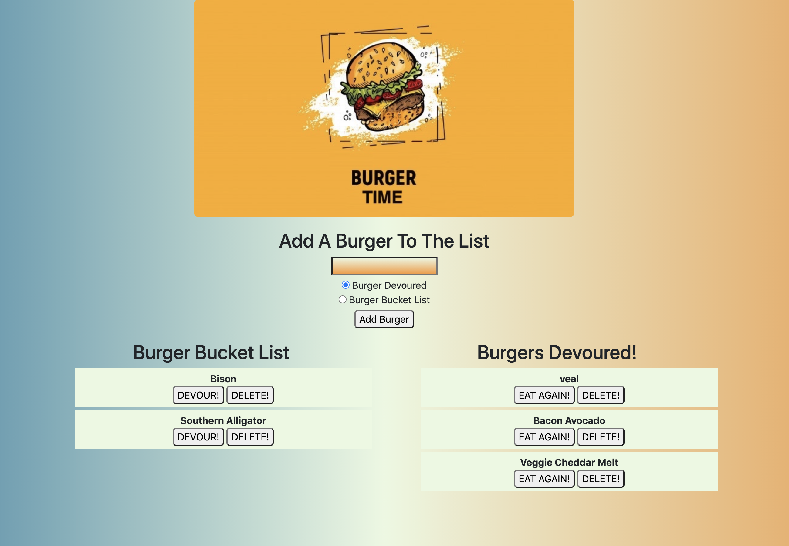

# Burger Time

## Descripttion 
This application is a burger logger app that uses MySQL, Node, Express, Handlebars, ORM, and follows the MVC design pattern. It uses Node and MySQL to query and route data, and Handlebars to generate the HTML. 

## Table of Contents
1. [Installation Instructions](#installation)
2. [Usage](#usage)
3. [Contributing to this Application](#contributing)
4. [How to test](#how-to-test)
5. [License](#license)
6. [Questions](#questions)

## Installation
This application is deployed on Heroku and does not require any installation before using. Click the link below to access the application.
[BurgerTime](https://burger-time2020.herokuapp.com)

## Usage
Users can utilize this application to keep track of burgers they have eaten or want to eat. 

BurgerTime Appication

# License
This is the license being used for this applicaiton. Please look at the LICENSE.txt file in the repository for more information.
* N/A

## Contributing
None

## How to Test
None

# Questions
Have questions? Contact the developer at: 
* GitHub Username: giocordova20
* Email: giocordova@gmail.com
